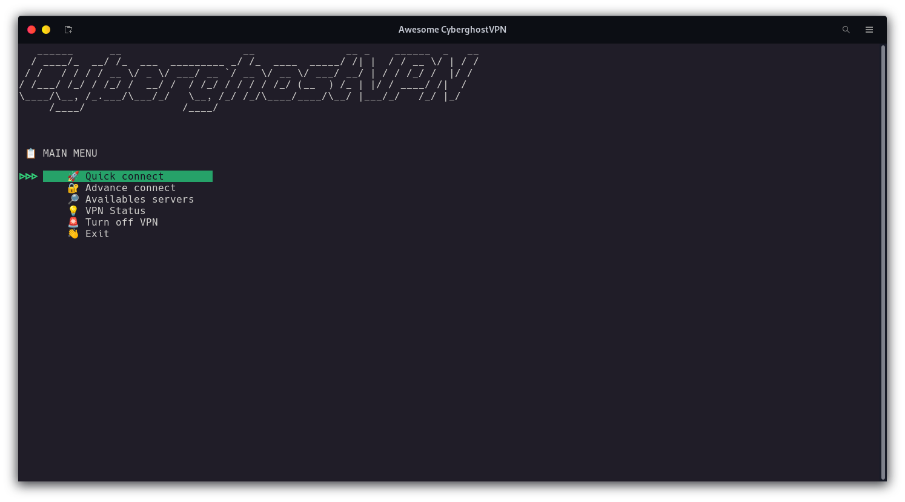
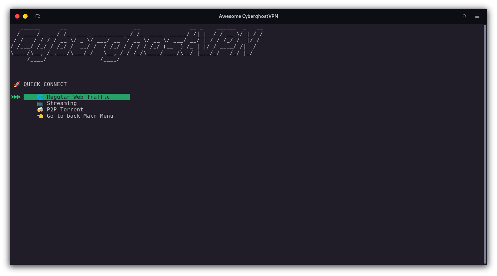
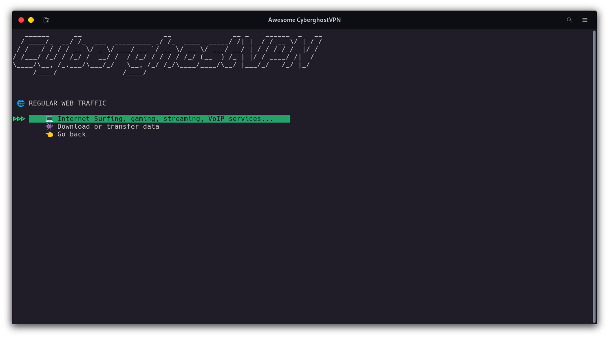
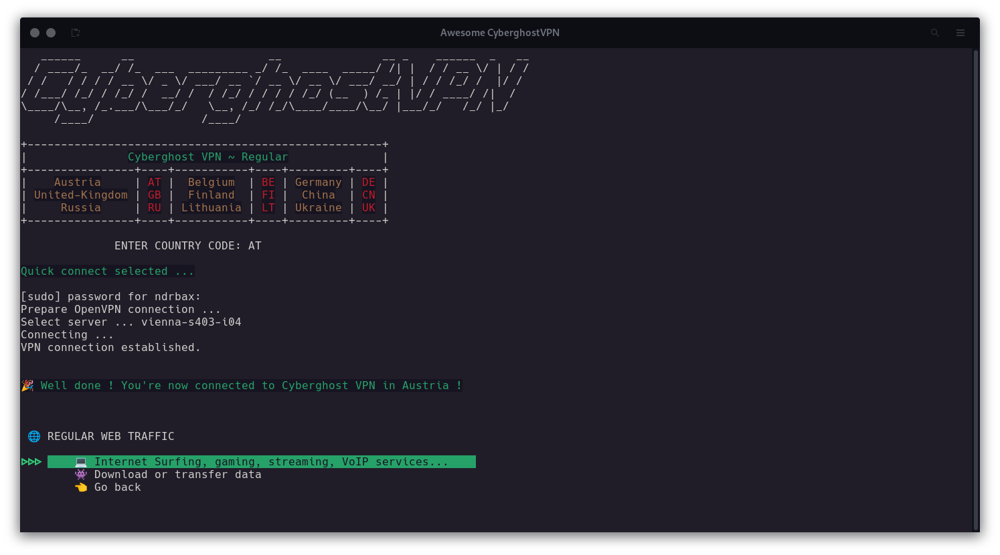
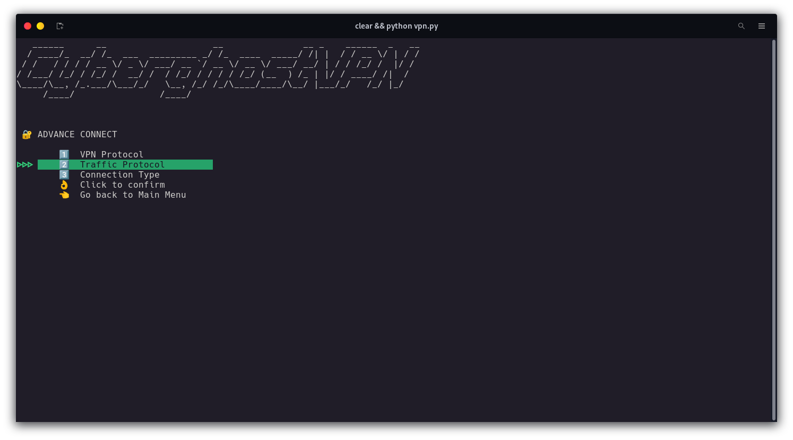
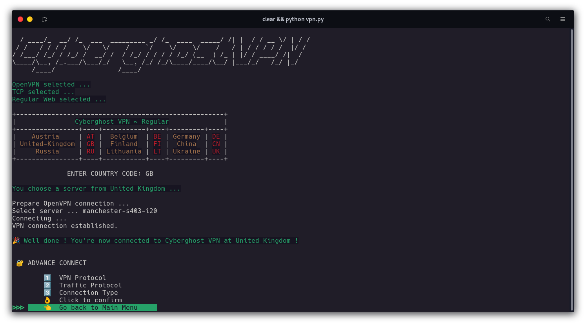

<div align="center" id="top"> 
  

&#xa0;

</div>

<h1 align="center">Awesome CyberghostVPN</h1>

<p align="center">
  
  
  
  
  

 
</p>

<!-- Status -->

<!-- <h4 align="center">
	🚧  Cyberghostvpn Cli   Public 🚀 Under construction...  🚧
</h4>

<hr> -->

<p align="center">
  <a href="#dart-about">About</a> &#xa0; | &#xa0; 
  <a href="#sparkles-features">Features</a> &#xa0; | &#xa0;
  <a href="#memo-license">License</a> &#xa0; | &#xa0;
  <a href="https://github.com/NDRBAX" target="_blank">Author</a>
</p>

<br>

## :dart: About

This is my first open source project, and the first one I coded in Python. Awesome CyberghostVPN is a tool that will make your VPN connections easier via command lines. It works perfectly on Linux. However, if you encounter any bugs, don't hesitate to contact me.

&#xa0;

## :sparkles: Features

:heavy_check_mark: Quick connect according to type of navigation (regular web traffic, streaming or p2p torrent)\
:heavy_check_mark: Advance connect : you can choose your personal settings such as protocols or connection type\
:heavy_check_mark: List of available servers

<div align="center">






</div>

&#xa0;

## :white_check_mark: Requirements

Before starting :checkered_flag:, you need to have [Python](https://www.python.org/) and [pip](https://pypi.org/project/pip/) installed.

&#xa0;

## :checkered_flag: Starting

```bash
# Clone this project
$ git clone https://github.com/NDRBAX/Awesome-CyberghostVPN.git

# Access
$ cd Awesome-CyberghostVPN

# Install dependencies
$ pip install -r requirements.txt

# Run the project
$ python vpn.py

```

&#xa0;

## :memo: License

This project is under license from MIT. For more details, see the [LICENSE](LICENSE.md) file.

Project logo - <a href="https://www.flaticon.com/free-icons/vpn" title="vpn icons">Awesome CyberghostVPN</a>

Made with :heart: by <a href="https://github.com/NDRBAX" target="_blank">NDRBAX</a>
&#xa0;

<a href="#top">Back to top</a>
